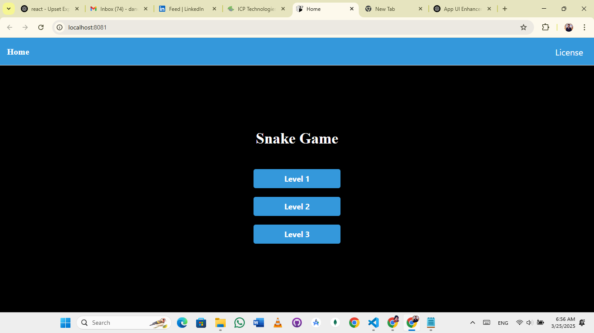
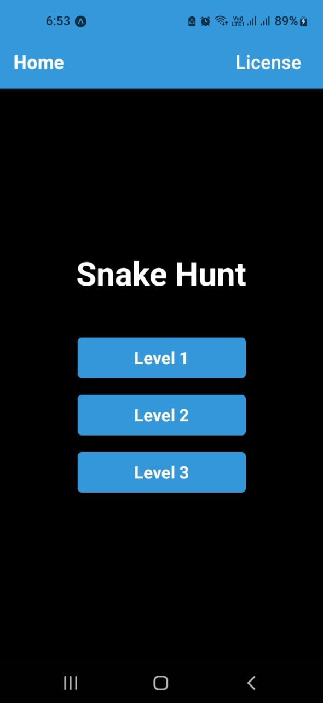
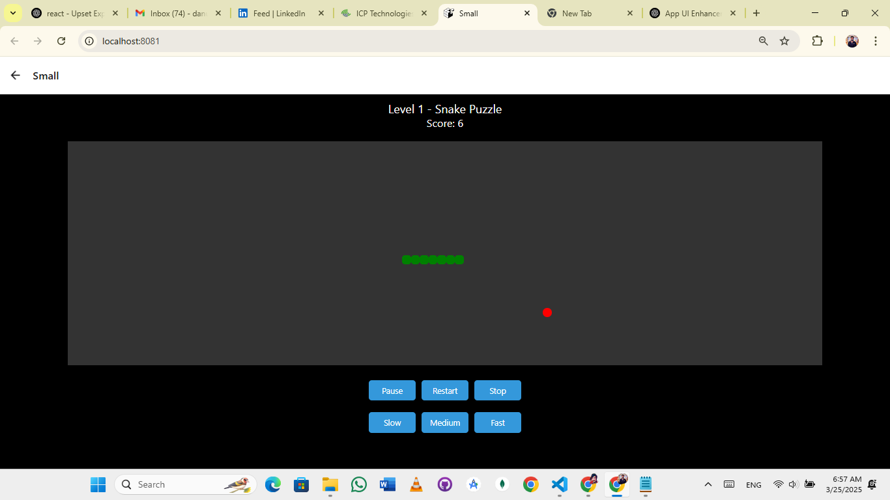
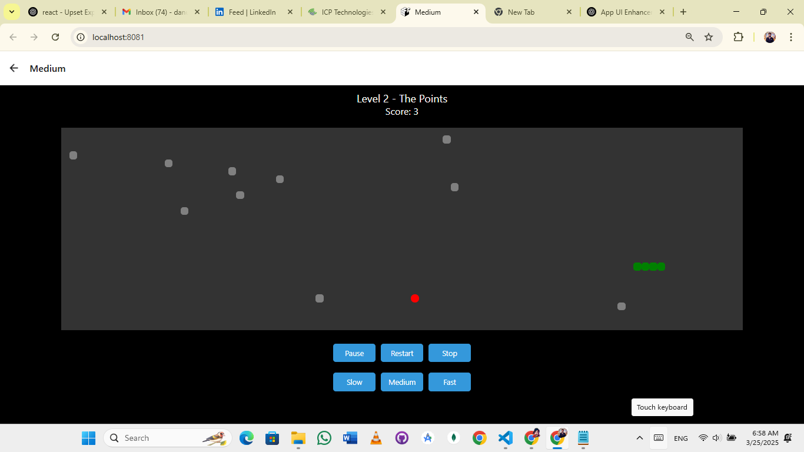
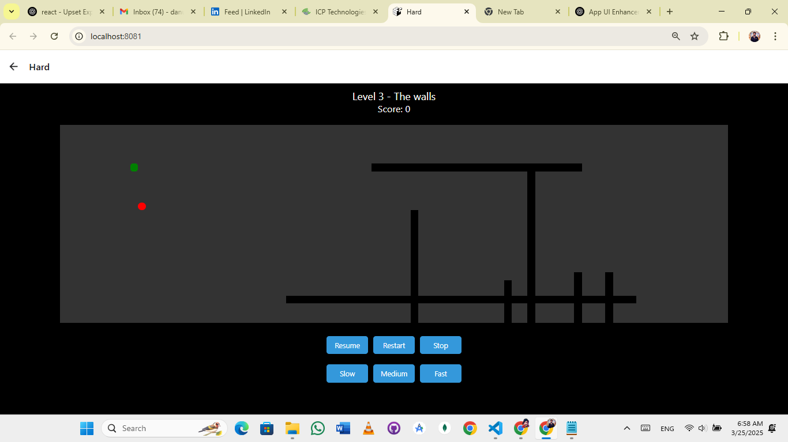
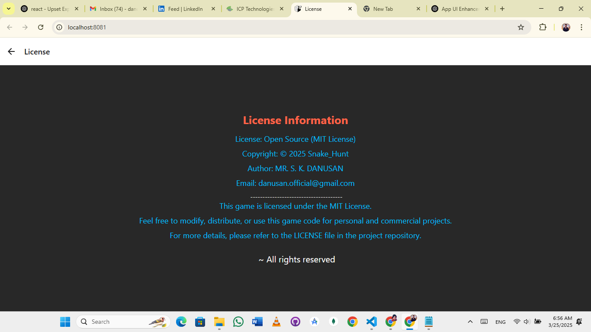
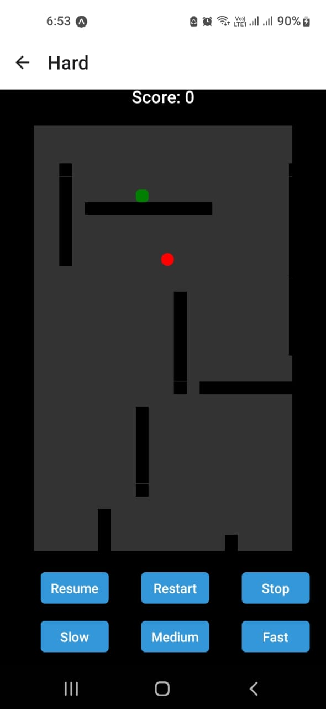

# Snake Hunt

A fun and interactive **Snake Hunt** built with **React Native** and **React Navigation**. The game includes **Level 1**, **Level 2**, and **Level 3** with increasing difficulty. The game also includes a **Home Screen** and **License Screen**.

## Features

- **Home Screen**: Main menu to navigate to different game levels.
- **Level 1**: Basic Snake game where the snake eats food and grows.
- **Level 2**: Adds some barriers or obstacles that increase the difficulty.
- **Level 3**: Even harder with additional obstacles and faster gameplay.
- **License Screen**: Provides licensing information for the game.
- **Mobile & Web Support**: Play the game both on mobile devices and browsers.
- **Touch Gestures**: Use swipe gestures to control the snake.

## Prerequisites

Before running this project, ensure you have the following installed:

- **Node.js** (Version 12 or higher)
- **React Native Environment Setup** for mobile development

### Steps to Run the Project:  
1. Clone the repository:  
   ```bash
   git clone https://github.com/dondanu/Snake.git

2. Navigate to the project directory:
   ```bash
   cd Snake

3. Install dependencies for both frontend and backend:
   ```bash
   npm install

4. Start the backend server:
   ```bash
   node server.js

5. Start the frontend:
   ```bash
   npm start

Access the application at http://localhost:3000.

# Screenshots
##Home Page - Browser
Displays the main menu for navigating between different game levels in Browser | Web


##Home Page - Mobile App
Displays the main menu for navigating between different game levels in Mobile App IOS | Android


##Level 1 - Browser
First level of the game with basic gameplay.


##Level 2 - Browser
Includes additional obstacles, making the game more challenging.


##Level 3 - Browser
The hardest level with more obstacles and faster gameplay.


##License - Browser
Displays the game's license information.


##Level 3 - Mobile App
The hardest level with more obstacles and faster gameplay in Mobile app



## Technologies Used

 - **Frontend:** React Native, React Navigation
 - **Backend:** Node.js (optional if you want to implement additional features like scoring or user data storage)
 - **Database:** MongoDB (Optional if user data storage is used)
 - **Styling:** React Native styles (using StyleSheet)
 - **Authentication:** React Navigation for handling screen navigation
 - **Deployment:** Expo (for React Native web support), or use native Android/iOS for mobile deployment

